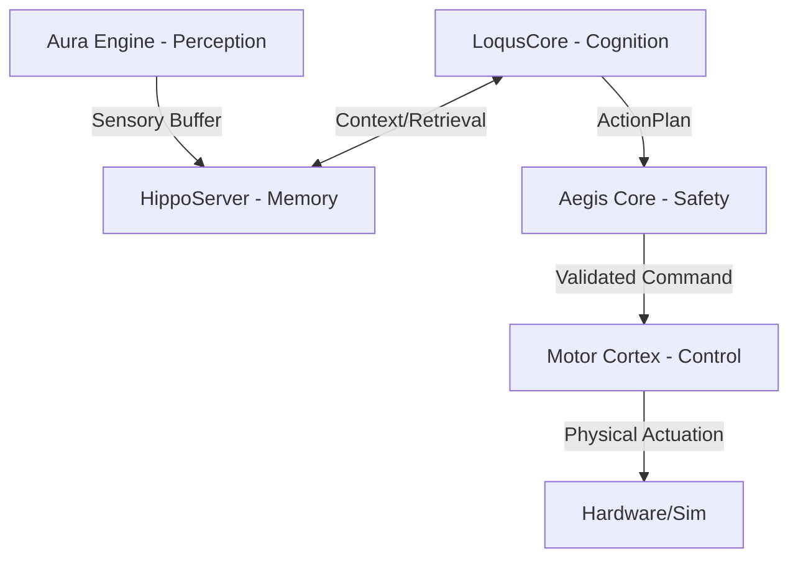

  

<h1 align="center">HilliumOS Core</h1>

  <strong>The Nervous System for Kinetic AI.</strong>
   
  <em>The foundational kernel for HilliumOS - enabling embodied AI to perceive, reason, and act safely in the physical world.</em>
    
  
  
  
  

---

> [!CAUTION]
> **This project is under active development. The MVP is not yet available.**
>
> The codebase is being built incrementally and is **not functional for end users at this stage**.
> APIs will change, modules are incomplete, and the system cannot be installed or run end-to-end.
>
> ⭐ **Star this repo to follow our progress.** We will update this notice when the first release is ready.

---

## 🎯 The Mission

**HilliumOS Core** is a high-performance, biologically-inspired kernel designed for autonomous robots and kinetic systems. It provides a multi-layer architecture that combines the industrial safety of **Rust** with the cognitive flexibility of **Python**, creating a deterministic and trustworthy bridge between digital intelligence and physical motion on real hardware.

---

## 🧠 Core Architecture

HilliumOS is organized into specialized "Cores" that mimic the human nervous system:

### 🔭 Technological Stack (MVP Core)

Our stack is curated for maximum reliability and local-first execution, optimized for edge hardware (Jetson Orin, Mac Studio).

| Component | Technology | Primary Libraries | Usage |
|-----------|------------|-------------------|-------|
| **Perception** | Python/ONNX | `faster-whisper`, `silero-vad`, `DINOv2` | Real-time Senses & Visual Validation |
| **Cognition** | Python/LLM | `LangChain`, `sqlparse`, `duckdb` | The Cognitive Council & SQL Observability |
| **Memory** | Rust | `sled`, `qdrant`, `rkyv`, `Zero-Copy IPC` | 4-Level Hierarchy (Sensory to Episodic) |
| **Safety** | Rust | `Aegis L7`, `VisualValidator` | Hallucination Prevention & Real-time Gating |
| **Control** | Rust | `MuJoCo`, `PyO3`, `ort` | Trajectory Planning & Hardware Abstraction |

---

## 🗺️ Development Status

We are building HilliumOS Core incrementally through structured Work Packages. This is where we stand:

| Phase | Focus | Status |
|-------|-------|--------|
| Phase 0 | Scaffolding & Project Structure | ✅ Done |
| Phase 1 | HippoServer (SHM, Zero-Copy IPC) | ✅ Done |
| Phase 2 | Memory Layers (Working, Associative) | ✅ Done |
| Phase 3 | Aegis Safety Core (7-Layer) | ✅ Done |
| Phase 4 | PyO3 Bridge & Python Bindings | 🔄 In Progress |
| Phase 5 | LoqusCore Cognitive Engine | 🔄 In Progress |
| Phase 6 | Motor Cortex & Simulation | ⏳ Planned |
| Phase 7+ | Autodidactic Gym, .hrec Format | ⏳ Planned |

> Installation instructions will be published here once Phase 5 is complete and the system can run end-to-end.

---

## 🛠️ Detailed Documentation

- **[DEPENDENCIES.md](DEPENDENCIES.md)**: Master manifest of Python, Rust, and System requirements for real-hardware deployment.
- **[DEVELOPMENT.md](DEVELOPMENT.md)**: Guidelines for TDD, conventional commits, and CI/CD pipelines.

---

## 🤝 Follow the Build

We build in public. The best way to stay up to date:

- ⭐ **Star this repo** — get notified when the first release drops
- 💬 [Join Discord](https://discord.gg/n7ChqvPWgR) — discuss architecture, ask questions, follow progress
- 🌐 [Visit Hillium.ai](https://www.hillium.ai) — vision, roadmap, and early access
- 📄 [MIT License](LICENSE)

  <strong>HilliumOS Core</strong> 
  Built with ❤️ for the future of Kinetic AI

