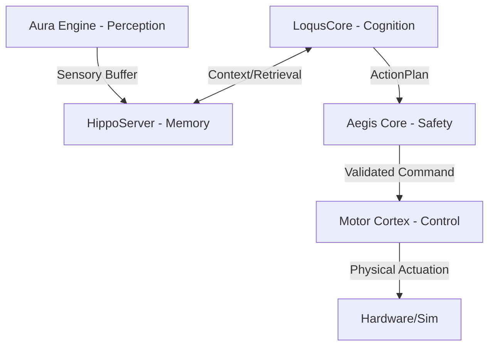

<p align="center">
  
</p>

<h1 align="center">HilliumOS Core</h1>

<p align="center">
  <strong>The Nervous System for Kinetic AI.</strong>
  <br />
  <em>The foundational kernel for HilliumOS - enabling embodied AI to perceive, reason, and act safely in the physical world.</em>
  <br /><br />
  
  
  
  
</p>

---

## 🎯 The Mission

**HilliumOS Core** is the high-performance, biologically-inspired kernel designed for the next generation of autonomous robots. It provides a multi-layer architecture that combines the industrial safety of **Rust** with the cognitive flexibility of **Python**, creating a deterministic and trustworthy bridge between digital intelligence and physical motion.

---

## 🧠 Core Architecture

HilliumOS is organized into specialized "Cores" that mimic the human nervous system:



### 🔭 Technological Stack (v9.5 - Embedding Intelligence)

Our stack is curated for maximum reliability and local-first execution (No Cloud dependencies).

| Component | Technology | Primary Libraries | Usage |
|-----------|------------|-------------------|-------|
| **Perception** | Python/ONNX | `faster-whisper`, `silero-vad`, `DINOv2` | Ears, Eyes, & Audio/Visual Validation |
| **Cognition** | Python/LLM | `LangChain`, `sqlparse`, `duckdb` | The Cognitive Council & SQL-based Observability |
| **Memory** | Rust | `sled`, `qdrant`, `rkyv`, `Zero-Copy IPC` | 4-Level Hierarchy (Sensory to Episodic) |
| **Safety** | Rust | `Aegis L7`, `VisualValidator` | Hallucination Prevention & Real-time Gating |
| **Control** | Rust | `MuJoCo`, `PyO3`, `ort` | Trajectory Planning & Hardware Abstraction |

---

## 🚀 One-Command Installation

We provide a specialized bootstrap script that automatically detects your hardware and configures the environment (Metal for Mac Studio, CUDA for Jetson Orin).

### Prerequisites
- **Docker** (Recommended for Hillium Forge development)
- **Rust 1.75+**
- **Python 3.11+**

### Bootstrap Setup
```bash
# Clone the repository
git clone https://github.com/hillium-ai/hillium-core.git
cd hillium-core

# Universal Bootstrap (Detects macOS/Linux/Forge)
./scripts/setup_dev.sh
```

> [!TIP]
> **Hillium Forge**: If you are using our Docker-based development environment, the bootstrap script will automatically handle PEP 668 restrictions and install system dependencies inside the container.

---

## 🛠️ Detailed Documentation

- **[DEPENDENCIES.md](DEPENDENCIES.md)**: Full manifest of all Python, Rust, and System requirements mapped to Work Packages.
- **[DEVELOPMENT.md](DEVELOPMENT.md)**: Guidelines for TDD, conventional commits, and CI/CD pipelines.
- **[CLAUDE.md](CLAUDE.md)**: Cultural and technical context for AI agents working on this project.

---

## 🏁 Verification & Testing

HilliumOS Core is built with a **Zero Tolerance for regressions** policy.

```bash
# Run the complete test suite
pytest tests/ -v
cargo test --all

# Audit the technology stack installation
python3 scripts/verify_env.py
```

---

## 🤝 Contributing & Community

Join the revolution in Kinetic AI. We follow the **Open Core** philosophy.

- 💬 [Join Discord](https://discord.gg/n7ChqvPWgR)
- 🌐 [Visit Hillium.ai](https://www.hillium.ai)
- 📄 [MIT License](LICENSE)

<p align="center">
  <strong>HilliumOS Core v0.1.0</strong><br>
  Built with ❤️ for the future of Kinetic AI
</p>
